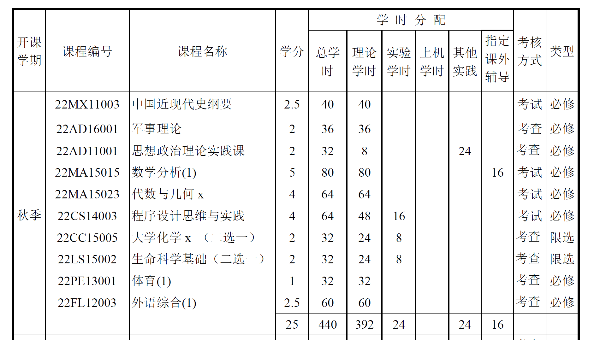
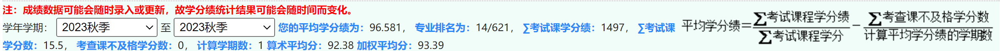

# **政策名词解读**

> 望文生义，最终只能酿成无法挽回的悲剧

初入工大，相信许多萌新肯定会对许多政策条文产生一些困惑。有些萌新甚至会望文生义，自己仅仅从字面上理解这些政策的含义。这是万万不可的！

而工大，或者说全部大学，几乎都没有一堂课，来告诉大家大学是如何运行的。大学由哪些机构组成，什么机构又是负责什么问题的。我们就好像插班生一样，跳过了一学期。

这不是萌新的错，我们也绝不能让自己承担这样的恶果。

## **成绩相关专有名词解读**

- 学分：每节课 **权重的体现** 。课时越大，学分越大
- 考核方式：
    - 考试：**参与学分绩计算** 
    - 考察：不参与学分绩计算，但是不及格会扣学分绩
    - ❗❗❗不是说期末有考试就叫做考试课，而是计算学分绩的才叫做考试课
- 类型：
    - 必修：是本学期必须学的课，参与计算算数平均分、加权平均分（**不是平均学分绩**）
    - 限选：基本是多选一
    - 选修：自己自主选的课，每个专业都有毕业选课总学分要求

- 学分绩：学分$\times$该门课成绩
- 平均学分绩：也叫裸学分绩，参与未来保研排名（**最终成绩=平均学分绩+保研加分**）
- 